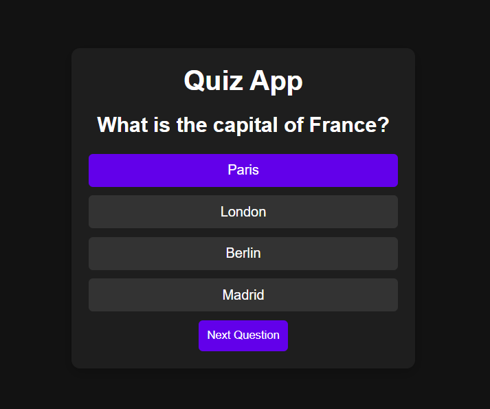

# 🧠 Simple Quiz App

A responsive and interactive quiz app built using **HTML**, **CSS**, and **JavaScript**. This app presents multiple-choice questions, lets users select their answers, and shows the final score at the end.

## 🚀 Features

- Start, next, and restart quiz functionality
- Score calculation
- Question navigation
- Clean and responsive UI
- Built entirely with vanilla JS

## 🖼️ Screenshot

<div align="center">
  
</div>


## 🛠️ Tech Stack

- HTML5
- CSS3
- JavaScript (Vanilla)

## 📁 Project Structure

```
📦 quiz-app/
├── index.html
├── style.css
├── script.js
└── screenshot.png
```

## 📸 How It Works

The quiz logic is driven by this code:

```javascript
document.addEventListener("DOMContentLoaded", () => {
  // All quiz logic here
});
```

It dynamically renders questions, handles answer selection, and calculates the score.

## 👤 Author

<div>
  <a href="https://github.com/anuj-singal" target="_blank">
    <br/>
    <strong>Anuj Singal</strong><br/>
  </a>
</div>

## 📝 License

This project is licensed under the [MIT License](./LICENSE).

